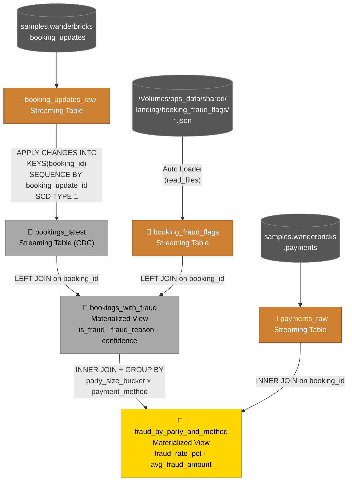
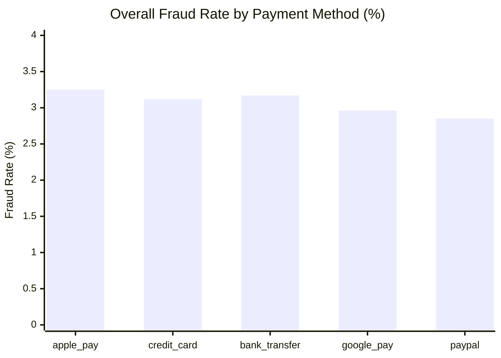
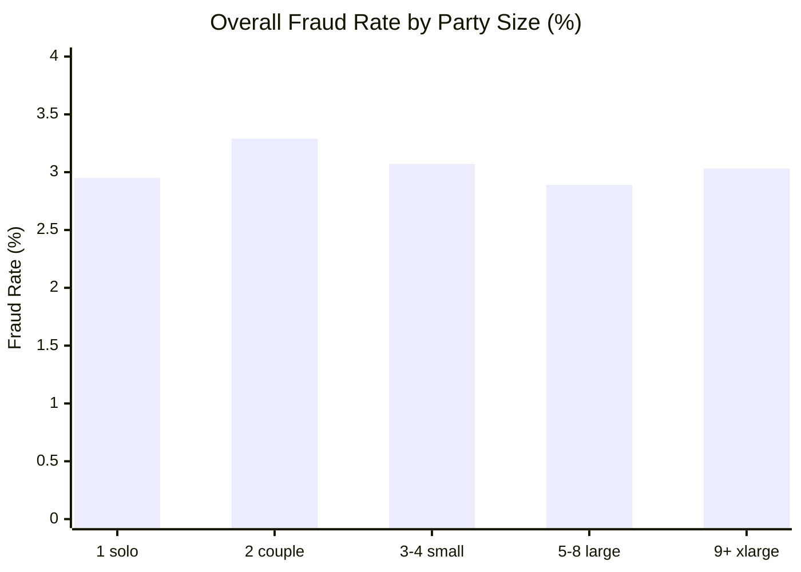
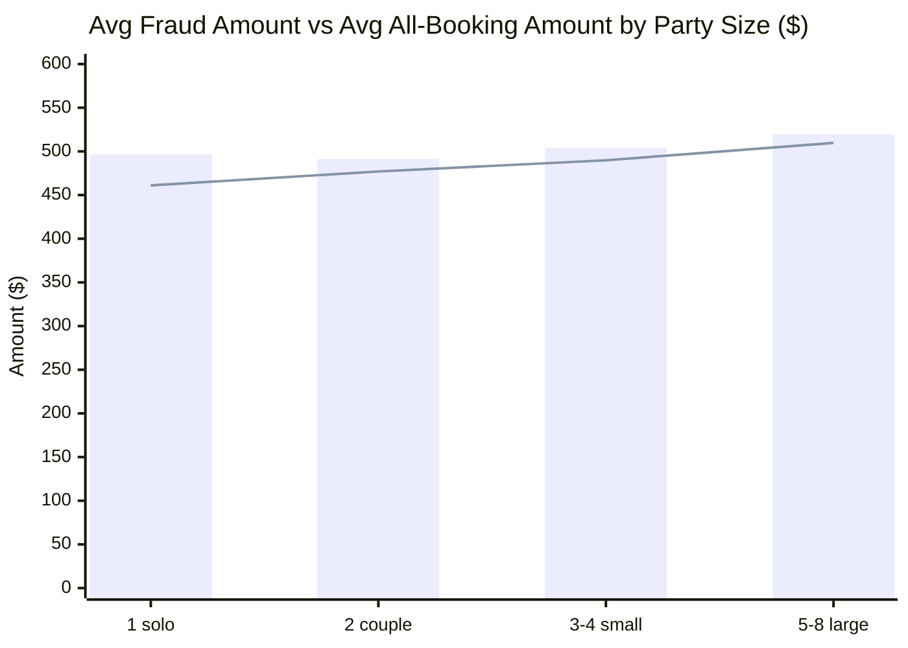

<div align="center">


# 🔍 Fraud Analysis Pipeline

[](https://databricks.com)
[](https://spark.apache.org)
[](#)
[](https://delta.io)

**A production-grade Lakeflow Spark Declarative Pipeline (SQL) that answers:**
> *"Is fraud risk related to party size and payment method?"*

</div>

---

## 📋 Table of Contents

- [Overview](#-overview)
- [Pipeline Architecture](#-pipeline-architecture)
- [Data Sources](#-data-sources)
- [Pipeline Settings](#-pipeline-settings)
- [Source Code](#-source-code)
- [Pipeline Run — Row Counts](#-pipeline-run--row-counts)
- [Gold Output — Full Results](#-gold-output--full-results)
- [Charts & Visualisations](#-charts--visualisations)
- [Business Answer](#-business-answer)

---

## 📖 Overview

This pipeline ingests three streaming sources — a CDC stream of booking updates, a live payment feed, and landing-zone fraud-flag JSON files — and processes them through a Bronze → Silver → Gold medallion architecture to produce a fraud-rate breakdown by **guest count** and **payment method**.

| Layer | Dataset | Type | Description |
|-------|---------|------|-------------|
| 🥉 Bronze | `booking_updates_raw` | Streaming Table | Raw CDC events from booking system |
| 🥉 Bronze | `payments_raw` | Streaming Table | Raw payment events |
| 🥉 Bronze | `booking_fraud_flags` | Streaming Table | Fraud flags from landing-zone JSON (Auto Loader) |
| 🥈 Silver | `bookings_latest` | Streaming Table (CDC) | Latest booking state via SCD Type-1 merge |
| 🥈 Silver | `bookings_with_fraud` | Materialized View | Bookings enriched with fraud flag columns |
| 🥇 Gold | `fraud_by_party_and_method` | Materialized View | Fraud rate aggregated by party size × payment method |

---

## 🏗️ Pipeline Architecture



---

## 📦 Data Sources

| Source | Type | Key Columns |
|--------|------|-------------|
| `samples.wanderbricks.booking_updates` | CDC stream | `booking_id`, `booking_update_id`, `guests_count`, `status`, `total_amount` |
| `samples.wanderbricks.payments` | Streaming | `payment_id`, `booking_id`, `amount`, `payment_method`, `status` |
| `/Volumes/ops_data/shared/landing/booking_fraud_flags/` | JSON files | `booking_id`, `flag`, `confidence`, `flagged_at`, `reason` |

---

## ⚙️ Pipeline Settings

| Setting | Value |
|---------|-------|
| **Catalog** | `de_workshop` |
| **Schema** | `labuser15231327_1781170922` |
| **Serverless** | ✅ `true` |
| **Photon** | ✅ `true` |
| **Channel** | `CURRENT` |
| **Continuous** | ❌ `false` (triggered) |
| **Source glob** | `./transformations/**` |

---

## 💻 Source Code

<details>
<summary><b>🥉 01_ingest.sql — Bronze streaming tables</b></summary>

```sql
-- =============================================================
-- 01_ingest.sql  –  Bronze streaming tables
-- Catalog: de_workshop  |  Schema: labuser15231327_1781170922
-- =============================================================

-- Bronze 1: raw CDC events from the wanderbricks booking system
CREATE OR REFRESH STREAMING TABLE booking_updates_raw
COMMENT 'Raw CDC booking-update events streamed from samples.wanderbricks.booking_updates'
AS
SELECT * FROM STREAM(samples.wanderbricks.booking_updates);

-- Bronze 2: raw payment events
CREATE OR REFRESH STREAMING TABLE payments_raw
COMMENT 'Raw payment events streamed from samples.wanderbricks.payments'
AS
SELECT * FROM STREAM(samples.wanderbricks.payments);

-- Bronze 3: fraud flag files arriving in the landing-zone volume
CREATE OR REFRESH STREAMING TABLE booking_fraud_flags
COMMENT 'Fraud-flag events loaded incrementally from landing-zone JSON files'
AS
SELECT
    CAST(booking_id  AS BIGINT)    AS booking_id,
    flag,
    CAST(confidence  AS DOUBLE)    AS confidence,
    CAST(flagged_at  AS TIMESTAMP) AS flagged_at,
    reason,
    _metadata.file_name            AS source_file
FROM STREAM read_files(
    '/Volumes/ops_data/shared/landing/booking_fraud_flags/',
    format => 'json',
    schema  => 'booking_id BIGINT, flag STRING, confidence DOUBLE, flagged_at STRING, reason STRING'
);
```

</details>

<details>
<summary><b>🥈 02_cdc.sql — CDC merge → bookings_latest</b></summary>

```sql
-- =============================================================
-- 02_cdc.sql  –  Apply CDC to materialise latest booking state
-- =============================================================

-- Declare the CDC target table first
CREATE OR REFRESH STREAMING TABLE bookings_latest
COMMENT 'Latest state of every booking, kept current via SCD Type-1 CDC merge';

-- Merge incoming update events into bookings_latest
APPLY CHANGES INTO bookings_latest
FROM   STREAM(booking_updates_raw)
KEYS   (booking_id)
SEQUENCE BY booking_update_id
STORED AS SCD TYPE 1;
```

</details>

<details>
<summary><b>🥈 03_silver.sql — bookings_with_fraud</b></summary>

```sql
-- =============================================================
-- 03_silver.sql  –  Silver: bookings enriched with fraud flags
-- =============================================================

CREATE OR REFRESH MATERIALIZED VIEW bookings_with_fraud
COMMENT 'Latest booking state left-joined with fraud flags; is_fraud=TRUE when a flag exists'
AS
SELECT
    b.booking_id,
    b.property_id,
    b.user_id,
    b.guests_count,
    b.status,
    b.total_amount,
    b.check_in,
    b.check_out,
    b.created_at,
    b.updated_at,
    -- fraud enrichment
    CASE WHEN f.flag IS NOT NULL THEN TRUE ELSE FALSE END AS is_fraud,
    f.confidence  AS fraud_confidence,
    f.reason      AS fraud_reason,
    f.flagged_at  AS fraud_flagged_at
FROM      bookings_latest       b
LEFT JOIN booking_fraud_flags   f  ON b.booking_id = f.booking_id;
```

</details>

<details>
<summary><b>🥇 04_gold.sql — fraud_by_party_and_method</b></summary>

```sql
-- =============================================================
-- 04_gold.sql  –  Gold: fraud rate by party size & payment method
-- Answers: "Is fraud risk related to party size and payment method?"
-- =============================================================

CREATE OR REFRESH MATERIALIZED VIEW fraud_by_party_and_method
COMMENT 'Fraud rate aggregated by guest-count bucket and payment method'
AS
SELECT
    CASE
        WHEN b.guests_count = 1                   THEN '1 - solo'
        WHEN b.guests_count = 2                   THEN '2 - couple'
        WHEN b.guests_count BETWEEN 3 AND 4       THEN '3-4 - small group'
        WHEN b.guests_count BETWEEN 5 AND 8       THEN '5-8 - large group'
        ELSE                                           '9+ - very large'
    END                                                  AS party_size_bucket,
    p.payment_method,
    COUNT(DISTINCT b.booking_id)                         AS total_bookings,
    SUM(CAST(b.is_fraud AS INT))                         AS fraud_bookings,
    ROUND(
        100.0 * SUM(CAST(b.is_fraud AS INT))
        / NULLIF(COUNT(DISTINCT b.booking_id), 0), 2
    )                                                    AS fraud_rate_pct,
    ROUND(AVG(CASE WHEN b.is_fraud
                   THEN CAST(p.amount AS DOUBLE) END), 2) AS avg_fraud_amount,
    ROUND(AVG(CAST(p.amount AS DOUBLE)), 2)              AS avg_booking_amount
FROM      bookings_with_fraud  b
INNER JOIN payments_raw        p  ON b.booking_id = p.booking_id
GROUP BY  party_size_bucket, p.payment_method
ORDER BY  fraud_rate_pct DESC;
```

</details>

---

## 📊 Pipeline Run — Row Counts

Results from a successful triggered update on **2026-06-11**:

| Dataset | Layer | Type | Row Count |
|---------|-------|------|----------:|
| `booking_updates_raw` | 🥉 Bronze | Streaming Table | **83,068** |
| `payments_raw` | 🥉 Bronze | Streaming Table | **49,638** |
| `booking_fraud_flags` | 🥉 Bronze | Streaming Table | **1,462** |
| `bookings_latest` | 🥈 Silver | Streaming Table (CDC) | **47,726** |
| `bookings_with_fraud` | 🥈 Silver | Materialized View | **47,726** |
| `fraud_by_party_and_method` | 🥇 Gold | Materialized View | **25** |

> 83,068 raw CDC events collapsed into 47,726 unique bookings (SCD Type-1 keeps only the latest state per `booking_id`). 1,462 fraud flags were matched across those bookings.

---

## 🥇 Gold Output — Full Results

`SELECT * FROM de_workshop.labuser15231327_1781170922.fraud_by_party_and_method ORDER BY fraud_rate_pct DESC`

| party_size_bucket | payment_method | total_bookings | fraud_bookings | fraud_rate_pct | avg_fraud_amount | avg_booking_amount |
|-------------------|---------------|---------------:|---------------:|---------------:|-----------------:|-------------------:|
| 9+ - very large | apple_pay | 11 | 1 | **9.09%** | $756.85 | $493.76 |
| 5-8 - large group | google_pay | 268 | 14 | **5.22%** | $483.93 | $518.10 |
| 2 - couple | credit_card | 2,283 | 97 | **4.25%** | $586.10 | $486.58 |
| 3-4 - small group | bank_transfer | 1,291 | 53 | **4.11%** | $525.95 | $475.31 |
| 2 - couple | apple_pay | 2,151 | 75 | **3.49%** | $432.39 | $477.45 |
| 5-8 - large group | apple_pay | 322 | 11 | **3.42%** | $635.34 | $527.03 |
| 3-4 - small group | apple_pay | 1,320 | 45 | **3.41%** | $546.83 | $483.12 |
| 1 - solo | bank_transfer | 3,867 | 122 | **3.15%** | $482.27 | $463.68 |
| 2 - couple | paypal | 2,288 | 72 | **3.15%** | $430.12 | $463.00 |
| 1 - solo | apple_pay | 3,910 | 119 | **3.04%** | $504.34 | $462.19 |
| 3-4 - small group | paypal | 1,275 | 38 | **2.98%** | $341.31 | $511.86 |
| 1 - solo | google_pay | 3,889 | 115 | **2.96%** | $516.70 | $466.90 |
| 1 - solo | credit_card | 3,778 | 111 | **2.94%** | $426.10 | $454.90 |
| 3-4 - small group | google_pay | 1,284 | 37 | **2.88%** | $562.07 | $487.03 |
| 2 - couple | bank_transfer | 2,225 | 63 | **2.83%** | $516.48 | $481.59 |
| 2 - couple | google_pay | 2,240 | 61 | **2.72%** | $420.08 | $476.35 |
| 1 - solo | paypal | 3,860 | 103 | **2.67%** | $495.59 | $457.46 |
| 5-8 - large group | paypal | 267 | 6 | **2.25%** | $432.70 | $501.94 |
| 3-4 - small group | credit_card | 1,382 | 28 | **2.03%** | $644.44 | $492.21 |
| 5-8 - large group | credit_card | 281 | 5 | **1.78%** | $536.68 | $528.06 |
| 5-8 - large group | bank_transfer | 283 | 5 | **1.77%** | $206.29 | $463.70 |
| 9+ - very large | paypal | 5 | 0 | 0.00% | — | $9.34 |
| 9+ - very large | credit_card | 6 | 0 | 0.00% | — | $598.86 |
| 9+ - very large | google_pay | 5 | 0 | 0.00% | — | $609.66 |
| 9+ - very large | bank_transfer | 6 | 0 | 0.00% | — | $737.92 |

---

## 📈 Charts & Visualisations

### Fraud Rate by Payment Method (aggregated across all party sizes)



> Weighted totals: apple_pay **3.25%** · bank_transfer **3.17%** · credit_card **3.12%** · google_pay **2.96%** · paypal **2.85%**

---

### Fraud Rate by Party Size (aggregated across all payment methods)



> Weighted totals: couple **3.29%** · small group **3.07%** · very large **3.03%** · solo **2.95%** · large group **2.89%**

---

### Fraud Rate Heatmap — Party Size × Payment Method

|  | apple_pay | credit_card | bank_transfer | google_pay | paypal |
|--|:---------:|:-----------:|:-------------:|:----------:|:------:|
| **1 - solo** | 3.04% | 2.94% | 3.15% | 2.96% | 2.67% |
| **2 - couple** | 3.49% | **4.25%** 🔴 | 2.83% | 2.72% | 3.15% |
| **3-4 - small group** | 3.41% | 2.03% | **4.11%** 🔴 | 2.88% | 2.98% |
| **5-8 - large group** | 3.42% | 1.78% | 1.77% | **5.22%** 🔴 | 2.25% |
| **9+ - very large** | **9.09%** 🔴 | 0.00% | 0.00% | 0.00% | 0.00% |

> 🔴 = highest fraud rate in that party-size row

---

### Avg Fraud Transaction Amount vs Avg Booking Amount



> Fraud transactions (bars) consistently involve **higher amounts** than average (line), across all party sizes.

---

## 🔍 Business Answer

### Is fraud risk related to party size and payment method?

**Yes — both dimensions matter, but in different ways:**

#### Payment Method
`apple_pay` and `bank_transfer` carry the **highest overall fraud rates** (~3.2–3.25%), while `paypal` is the safest (~2.85%). The spread is relatively narrow (~0.4pp), suggesting payment method is a **moderate signal**.

#### Party Size
The relationship is **non-linear**:
- **Couples (2 guests)** are the highest-risk party size at **3.29%**
- Solo and small groups sit around **2.95–3.07%**
- Large groups (5–8) are *lower* at **2.89%**
- Very large groups (9+) are statistically unreliable (n=33 total)

#### The Compound Signal
The **combination** of party size + payment method is the most predictive:

| Rank | Segment | Fraud Rate | Sample Size |
|------|---------|-----------|------------|
| 🥇 1 | 9+ guests + apple_pay | 9.09% | 11 (small sample) |
| 🥈 2 | 5–8 guests + google_pay | 5.22% | 268 |
| 🥉 3 | 2 guests + credit_card | 4.25% | 2,283 ✅ |
| 4 | 3–4 guests + bank_transfer | 4.11% | 1,291 ✅ |

**Actionable recommendation:** Flag bookings from **couples paying by credit card** and **small groups using bank transfer** for enhanced review — these are the highest-confidence high-fraud segments (large sample sizes, fraud rates ~1.5× the baseline).

Fraudulent bookings also tend to be **higher value** than average: avg fraud transaction amounts are $30–$50 above the mean across all segments, suggesting fraudsters deliberately target premium bookings.

---

<div align="center">

Made with ❤️ using [Databricks Lakeflow Spark Declarative Pipelines](https://databricks.com)

</div>
