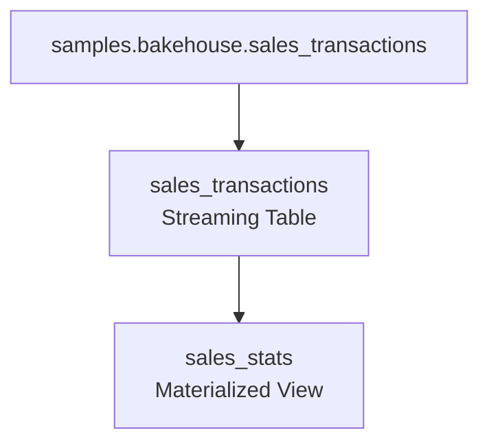
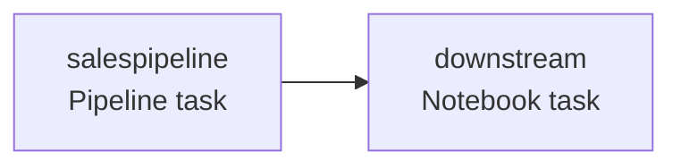

# pipelineshifa-job

A compact Databricks project export containing a Lakeflow Spark Declarative Pipeline, a multi-task Job, and supporting documentation.

## Overview

This project contains:

* A **Lakeflow Spark Declarative Pipeline** named `pipelineshifa`
* A **streaming table** `sales_transactions` that reads from `samples.bakehouse.sales_transactions`
* A **materialized view** `sales_stats` that aggregates sales KPIs and applies data quality expectations
* A **Databricks Job** named `shifaJOb` with two tasks:
  * `salespipeline` — runs the pipeline
  * `downstream` — runs a notebook after the pipeline succeeds

## Folder structure

```text
pipelineshifa-job/
├── README.md
├── pipeline/
│   ├── pipeline_config.json
│   └── transformations/
│       ├── sales_transactions.py
│       └── sales_stats.sql
├── job/
│   └── job_config.json
├── notebooks/
│   └── downstream.py
└── screenshots/
    └── README.md
```

## Pipeline DAG



### Pipeline details

| Property | Value |
| --- | --- |
| Pipeline name | `pipelineshifa` |
| Catalog | `shifa` |
| Schema | `mywork` |
| Mode | `WORKSPACE` |
| Channel | `CURRENT` |
| Serverless | `true` |
| Photon | `true` |
| Continuous | `false` |

## Job DAG



### Job details

| Property | Value |
| --- | --- |
| Job name | `shifaJOb` |
| Format | `MULTI_TASK` |
| Max concurrent runs | `1` |
| Queue enabled | `true` |
| Performance target | `PERFORMANCE_OPTIMIZED` |

## Data quality rules in `sales_stats`

The materialized view defines three expectations:

* `reasonable_avg_value` — keeps values where `avg_txn_value BETWEEN 1 AND 1000`
* `nonneg_revenue` — drops rows with negative revenue
* `known_product` — fails the update if `product IS NULL`

## Source and output

### Source

* `samples.bakehouse.sales_transactions`

### Output tables

* `shifa.mywork.sales_transactions`
* `shifa.mywork.sales_stats`

## Screenshots

Add these images under the `screenshots/` folder and reference them here:

```markdown


```

## How to run

1. Create or import the pipeline using `pipeline/pipeline_config.json`
2. Add the source files from `pipeline/transformations/`
3. Create the job using `job/job_config.json`
4. Ensure the downstream notebook points to `notebooks/downstream.py`
5. Run the job and verify `sales_stats` is refreshed

## Notes

* The original pipeline failure was caused by a missing `.sql` suffix on `sales_stats`
* The corrected export includes `sales_stats.sql`
* Screenshot placeholders are documented in `screenshots/README.md`
